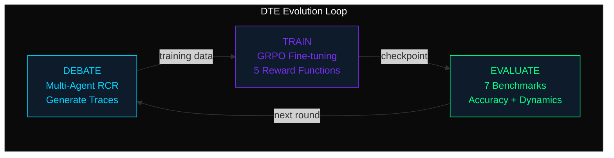
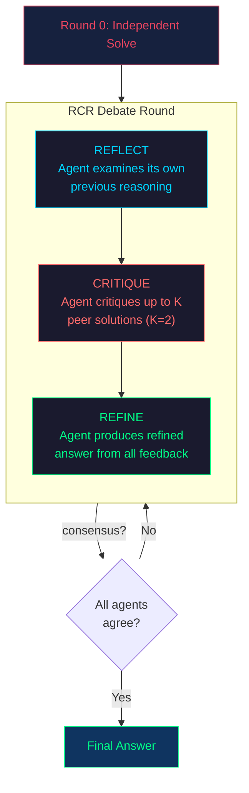
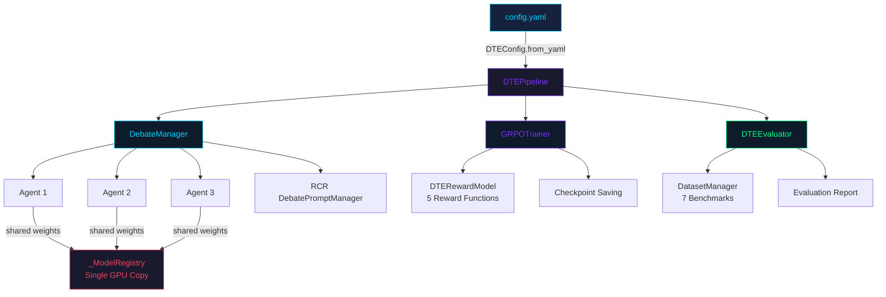

# Architecture Guide

This document describes the internal architecture of the DTE framework: how
the components are organized, how data flows through the pipeline, and how
everything fits together.

## Table of Contents

- [High-Level Overview](#high-level-overview)
- [Package Structure](#package-structure)
- [The DTE Pipeline](#the-dte-pipeline)
- [Component Deep Dives](#component-deep-dives)
  - [Configuration System](#configuration-system)
  - [Debate System](#debate-system)
  - [Training System](#training-system)
  - [Evaluation System](#evaluation-system)
  - [Data System](#data-system)
  - [Utilities](#utilities)

---

## High-Level Overview

DTE operates as an iterative loop of three phases:



```
    ╔══════════════════════════════════════════════════════════════════════╗
    ║                     DTE EVOLUTION LOOP                              ║
    ║                                                                     ║
    ║   ┌─────────────┐     ┌─────────────┐     ┌─────────────────┐      ║
    ║   │   DEBATE     │────▶│    TRAIN     │────▶│    EVALUATE     │     ║
    ║   │  Multi-Agent │     │  GRPO with   │     │  7 Benchmarks   │     ║
    ║   │  RCR Prompts │     │  5 Rewards   │     │  + Debate Dyn.  │     ║
    ║   └─────────────┘     └─────────────┘     └────────┬────────┘      ║
    ║         ▲                                           │               ║
    ║         │              next evolution                │               ║
    ║         └───────────── round ◀───────────────────────┘               ║
    ║                                                                     ║
    ╚══════════════════════════════════════════════════════════════════════╝
```

1. **Debate**: Multiple agents solve problems through structured
   multi-round discussion using RCR (Reflect-Critique-Refine) prompting.
   High-quality debate traces are collected as training data.

2. **Train**: The base model is fine-tuned using GRPO (Group Relative
   Policy Optimization) on the debate-generated data, with 5 specialized
   reward functions providing the training signal.

3. **Evaluate**: The trained model is evaluated on standard benchmarks
   (GSM8K, MATH, ARC-Challenge, etc.) to measure improvement.

The loop repeats for multiple **evolution rounds** until convergence or a
maximum number of rounds is reached.

---

## Package Structure

```
dte/
|-- __init__.py              # Public API: debate(), train(), evaluate(), from_config()
|
|-- core/                    # Core orchestration and infrastructure
|   |-- __init__.py
|   |-- config.py            # All configuration dataclasses + YAML I/O
|   |-- pipeline.py          # DTEPipeline: end-to-end orchestrator
|   |-- evaluator.py         # DTEEvaluator: benchmark evaluation
|   |-- logger.py            # DTELogger: structured logging + Rich console
|
|-- debate/                  # Multi-agent debate system
|   |-- __init__.py
|   |-- agent.py             # DebateAgent + model weight sharing registry
|   |-- manager.py           # DebateManager: debate orchestration
|   |-- prompts.py           # RCR prompt generation + response parsing
|
|-- training/                # GRPO training system
|   |-- __init__.py
|   |-- grpo_trainer.py      # GRPOTrainer: full GRPO implementation
|   |-- reward_model.py      # DTERewardModel: all 5 reward functions
|
|-- data/                    # Data management
|   |-- __init__.py
|   |-- dataset_manager.py   # DatasetManager: HuggingFace dataset loading
|   |-- generator.py         # DebateDataGenerator: debate -> training data
|   |-- processor.py         # Data processing utilities
|
|-- utils/                   # Shared utilities
    |-- __init__.py
    |-- answer_extraction.py # Answer extraction, consensus, sycophancy
    |-- data_utils.py        # JSONL I/O, splitting, filtering
    |-- helpers.py           # Error classes, device utils, timing
```

---

## The DTE Pipeline

The `DTEPipeline` class (`dte/core/pipeline.py`) is the top-level
orchestrator. Here is its lifecycle:

```
DTEPipeline.__init__(config)
    |
    +-- config.setup_environment()       # Seeds, directories, env vars
    +-- DTELogger(config.logging)        # Set up logging
    +-- DebateDataGenerator(...)         # Debate data generation component
    +-- GRPOTrainer(...)                 # Training component
    +-- DTEEvaluator(...)               # Evaluation component
    |
    v
DTEPipeline.run_complete_pipeline()
    |
    +-- _initialize_experiment_tracking()   # W&B init if enabled
    |
    +-- for round_num in 1..max_rounds:
    |       |
    |       +-- Phase 1: DebateDataGenerator.generate_training_data()
    |       |       |
    |       |       +-- DebateManager.conduct_debate() x N samples
    |       |       +-- Filter high-quality examples
    |       |       +-- Save to JSONL
    |       |
    |       +-- Phase 2: GRPOTrainer.train(examples)
    |       |       |
    |       |       +-- Generate multiple responses per query
    |       |       +-- Compute rewards (5 functions)
    |       |       +-- Calculate group-relative advantages
    |       |       +-- Optimize per-token log-prob ratios
    |       |       +-- Save checkpoint on improvement
    |       |
    |       +-- Phase 3: DTEEvaluator.evaluate_model()
    |       |       |
    |       |       +-- Load benchmark datasets
    |       |       +-- Run debates on test samples
    |       |       +-- Compute accuracy, consensus, sycophancy metrics
    |       |
    |       +-- Check convergence (patience, threshold)
    |
    +-- _generate_final_results()        # Save JSON report
    +-- _cleanup()                       # Free GPU memory
```

---

## Component Deep Dives

### Configuration System

**File**: `dte/core/config.py`

The configuration system is built entirely from Python `dataclass` objects.
There is no ad-hoc dictionary access -- every parameter is typed and has a
documented default.

```
DTEConfig (top-level)
    |-- ModelConfig           # Model name, device, temperature, top_p, top_k
    |-- DebateConfig          # num_agents, max_rounds, consensus settings
    |   |-- DebatePromptingConfig   # RCR enabled, critique_pairs
    |   |-- TemperatureAnnealingConfig
    |-- DatasetsConfig        # Dataset names, max_samples, quality threshold
    |-- TrainingConfig        # LR, epochs, batch_size, grad_accum
    |   |-- GRPOConfig        # group_size, clip_ratio, kl_penalty
    |   |-- RewardsConfig     # Weight for each of 5 reward functions
    |   |-- LoRAConfig        # LoRA rank, alpha, dropout, target_modules
    |-- EvolutionConfig       # max_rounds, convergence_threshold, patience
    |-- LoggingConfig         # level, log_dir, metrics to track
    |-- HardwareConfig        # device, mixed_precision, grad_checkpointing
    |-- PathsConfig           # output_dir, models_dir, data_dir, cache_dir
    |-- ExperimentConfig      # name, seed, deterministic, wandb config
    |-- SafetyConfig          # filtering, validation, backup settings
```

Configuration can be loaded from YAML:

```python
config = DTEConfig.from_yaml("config.yaml")
```

Or constructed programmatically:

```python
config = DTEConfig(
    model=ModelConfig(base_model_name="Qwen/Qwen2.5-1.5B-Instruct"),
    debate=DebateConfig(num_agents=3, max_rounds=3),
)
```

Validation is comprehensive:

```python
errors = config.validate()         # basic checks
errors = config.validate_strict()  # stricter checks
config.validate_and_raise()        # raises ConfigurationError on failure
```

The validator checks 7 supported datasets: `gsm8k`, `gsm_plus`, `math`,
`arc_challenge`, `arc_easy`, `gpqa`, `commonsense_qa`.

### Debate System

The debate system consists of three tightly coupled modules:

```
DebateManager (manager.py)
    |
    +-- DebateAgent[] (agent.py)       # N agents, weight-shared
    |       |
    |       +-- _ModelRegistry         # Singleton model cache
    |       +-- DebatePromptManager    # Prompt generation
    |
    +-- DebatePromptManager (prompts.py)
```

**Model Weight Sharing** (`agent.py`):

When multiple agents use the same model (the default DTE paradigm), a
module-level `_ModelRegistry` ensures only one copy of the model is loaded.
The registry is thread-safe and reference-counted:

```
Agent 1 --+
           |
Agent 2 --+--> _ModelRegistry["Qwen/...", "cuda"] --> single model instance
           |
Agent 3 --+
```

When all agents are cleaned up, the reference count drops to zero and the
model is freed from GPU memory.

**RCR Prompting** (`prompts.py`):

Round 0 uses a standard problem-solving prompt. Rounds 1+ use the
three-phase RCR (Reflect-Critique-Refine) prompt:



```
    ┌─────────────────────────────────────────────────────────────────┐
    │                    RCR DEBATE FLOW                               │
    │                                                                  │
    │   Round 0 ─── Each agent independently solves the problem        │
    │                                                                  │
    │   Round 1+ ── Three-phase RCR:                                   │
    │                                                                  │
    │     ┌──────────────┐   ┌──────────────┐   ┌──────────────┐      │
    │     │   REFLECT     │──▶│   CRITIQUE   │──▶│    REFINE    │      │
    │     │ Examine own   │   │ Critique K   │   │ Produce new  │      │
    │     │ reasoning     │   │ peer answers │   │ refined ans  │      │
    │     └──────────────┘   └──────────────┘   └──────────────┘      │
    │                                                                  │
    │   Consensus? ─── All agents agree → STOP                        │
    │                  Otherwise → next RCR round                      │
    └─────────────────────────────────────────────────────────────────┘
```

Three task types are supported: `math`, `arc`, `general`. Each has
task-specific prompt templates and answer extraction logic.

**Consensus Detection**:

After each round, the manager calls `check_consensus()` which compares
all extracted answers using numerical matching with `1e-9` tolerance.
If consensus is reached, the debate stops early.

**Sycophancy Detection**:

After each round, `detect_sycophancy()` checks whether any agent
abandoned its previous answer to match a peer's previous answer. This
metric is tracked per round and aggregated in the final metrics.

### Training System

**File**: `dte/training/grpo_trainer.py`

GRPO (Group Relative Policy Optimization) eliminates the need for a
separate value function. For each training query, `group_size` responses
are sampled, scored with the reward model, and z-score normalized into
advantages.

Key implementation details:

1. **Per-token log-probability ratios**: The log-prob of the *actual
   next token* is gathered from both the policy and frozen reference
   model. The per-token ratio `log_pi(t) - log_pi_ref(t)` is computed,
   then averaged over response tokens. This avoids the incorrect
   practice of averaging over the vocabulary dimension.

2. **8-bit AdamW**: When `bitsandbytes` is installed, the optimizer
   uses 8-bit AdamW with betas `(0.9, 0.99)` as specified in the
   DTE paper.

3. **Clipped surrogate + KL penalty**: Standard PPO-style clipping
   combined with a KL divergence penalty against the reference model.

**Reward Model** (`dte/training/reward_model.py`):

Five reward functions provide the training signal:

```
+---------------------+---------+------------------------------------------+
| Function            | Weight  | Description                              |
+---------------------+---------+------------------------------------------+
| correctness_reward  |   2.0   | +2.0 for matching ground truth           |
| int_reward          |   0.5   | +0.5 for numeric answer                  |
| strict_format       |   0.5   | +0.5 for exact XML format                |
| soft_format         |   0.5   | +0.5 for flexible XML structure          |
| xmlcount_reward     |   0.5   | Granular per-tag scoring (4 x 0.125)     |
+---------------------+---------+------------------------------------------+
```

Rewards are combined as a **weighted sum** (not average). With default
weights and a perfect response, the maximum combined reward is:

```
2.0 * 2.0 + 0.5 * 0.5 + 0.5 * 0.5 + 0.5 * 0.5 + 0.5 * 0.5 = 5.0
```

### Evaluation System

**File**: `dte/core/evaluator.py`

The evaluator runs multi-agent debates on benchmark datasets and measures:

- **Overall accuracy**: fraction of correctly answered questions
- **Consensus rate**: fraction of debates reaching unanimous agreement
- **Debate helped rate**: fraction where debate improved over initial majority
- **Sycophancy rate**: fraction of answer changes that match a peer's previous answer
- **Correct-to-incorrect / incorrect-to-correct rates**: transition analysis
- **Average reasoning length**: mean character length of agent reasoning traces
- **Per-dataset metrics**: all of the above broken down by dataset

### Data System

**DatasetManager** (`dte/data/dataset_manager.py`):

Handles loading and preprocessing of 7 supported benchmarks:

| Dataset          | HuggingFace ID              | Task Type |
|------------------|-----------------------------|-----------|
| gsm8k            | gsm8k (main)                | math      |
| gsm_plus         | qintongli/GSM-Plus          | math      |
| math             | hendrycks/competition_math  | math      |
| arc_challenge    | allenai/ai2_arc (Challenge) | arc       |
| arc_easy         | allenai/ai2_arc (Easy)      | arc       |
| gpqa             | Idavidrein/gpqa (main)      | general   |
| commonsense_qa   | tau/commonsense_qa          | arc       |

**DebateDataGenerator** (`dte/data/generator.py`):

Orchestrates the data generation phase:
1. Loads training datasets
2. Samples queries proportionally
3. Conducts debates on each query
4. Converts debate results to `TrainingExample` objects
5. Applies quality filters (consensus, confidence, reasoning length)
6. Saves as JSONL

### Utilities

**Answer Extraction** (`dte/utils/answer_extraction.py`):

- `extract_final_answer()`: Extracts from `\boxed{}`, dollar amounts, plain numbers
- `extract_arc_answer()`: Extracts letter choices (A-D)
- `check_consensus()`: Unanimous agreement with `1e-9` tolerance
- `detect_sycophancy()`: Identifies peer-matching answer changes
- `consolidate_reasoning_traces()`: Extracts best reasoning steps

**Error Handling** (`dte/utils/helpers.py`):

A hierarchy of typed exceptions:

```
DTEError (base)
    |-- ConfigurationError
    |-- DebateError
    |-- TrainingError
    |-- DataError
    |-- ModelError
```

Plus utility functions: `Timer`, `format_time()`, `validate_device()`,
`safe_execute()`, `robust_retry()`, etc.

---

## Data Flow Diagram



```
    ╔══════════════════════════════════════════════════════════════════════╗
    ║                          DATA FLOW                                  ║
    ╠══════════════════════════════════════════════════════════════════════╣
    ║                                                                     ║
    ║                      ┌──────────────┐                               ║
    ║                      │  config.yaml  │                               ║
    ║                      └──────┬───────┘                               ║
    ║                  DTEConfig.from_yaml()                               ║
    ║                      ┌──────▼───────┐                               ║
    ║                      │  DTEPipeline  │                               ║
    ║                      └──────┬───────┘                               ║
    ║          ┌──────────────────┼──────────────────┐                    ║
    ║          ▼                  ▼                   ▼                    ║
    ║   ┌─────────────┐   ┌─────────────┐   ┌───────────────┐           ║
    ║   │ DebateManager│   │ GRPOTrainer │   │ DTEEvaluator  │           ║
    ║   └──────┬──────┘   └──────┬──────┘   └───────┬───────┘           ║
    ║          │                  │                   │                    ║
    ║   ┌──────▼──────┐   ┌──────▼──────┐   ┌───────▼───────┐           ║
    ║   │ Agent x3    │   │ RewardModel │   │ DatasetManager│           ║
    ║   │ (shared GPU)│   │ (5 funcs)   │   │ (7 benchmarks)│           ║
    ║   └──────┬──────┘   └──────┬──────┘   └───────┬───────┘           ║
    ║          │                  │                   │                    ║
    ║   ┌──────▼──────┐   ┌──────▼──────┐   ┌───────▼───────┐           ║
    ║   │ RCR Prompts │   │ Checkpoint  │   │ Accuracy Rpt  │           ║
    ║   └─────────────┘   └─────────────┘   └───────────────┘           ║
    ╚══════════════════════════════════════════════════════════════════════╝
```
