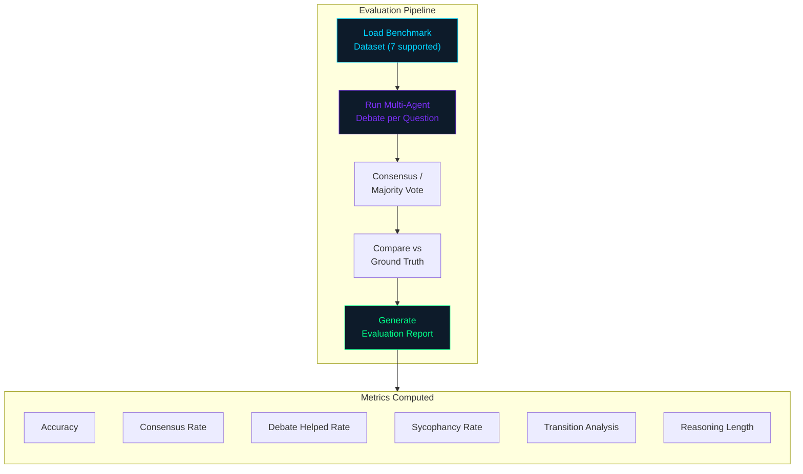

# Evaluation Guide

How to evaluate models on standard benchmarks using the DTE framework's
multi-agent debate evaluation methodology.

## Table of Contents

- [Overview](#overview)
- [Quick Evaluation](#quick-evaluation)
- [Detailed Evaluation](#detailed-evaluation)
- [Supported Benchmarks](#supported-benchmarks)
- [Understanding Evaluation Metrics](#understanding-evaluation-metrics)
- [Evaluation Report](#evaluation-report)
- [Comparing Models](#comparing-models)
- [Tips for Meaningful Evaluation](#tips-for-meaningful-evaluation)

---

## Overview

DTE evaluation runs multi-agent debates on benchmark questions and measures:

1. **Accuracy**: Does the debate produce the correct answer?
2. **Debate dynamics**: Does the debate help? Does sycophancy occur?
3. **Reasoning quality**: How long and detailed are the reasoning traces?



Each evaluation sample goes through a full 3-agent, multi-round debate.
The final answer is determined by consensus or majority vote.

---

## Quick Evaluation

```python
import dte

report = dte.evaluate(
    model="Qwen/Qwen2.5-1.5B-Instruct",
    datasets=["gsm8k"],
    num_agents=3,
    max_rounds=3,
    max_samples=50,
    verbose=True,
)

print(f"Accuracy:       {report['overall_metrics']['accuracy']:.2%}")
print(f"Consensus rate: {report['overall_metrics']['consensus_rate']:.2%}")
print(f"Debate helped:  {report['overall_metrics']['debate_helped_rate']:.2%}")
print(f"Sycophancy:     {report['overall_metrics']['sycophancy_rate']:.2%}")
```

---

## Detailed Evaluation

For full control over the evaluation process:

```python
from dte.core.config import ModelConfig, DebateConfig, DatasetsConfig, LoggingConfig
from dte.core.logger import DTELogger
from dte.core.evaluator import DTEEvaluator

# Configure
model_config = ModelConfig(
    base_model_name="Qwen/Qwen2.5-1.5B-Instruct",
    device="auto",
    max_length=2048,
    temperature=0.7,
)

debate_config = DebateConfig(
    num_agents=3,
    max_rounds=3,
)

datasets_config = DatasetsConfig(
    names=["gsm8k", "arc_challenge"],
    max_samples_per_dataset=100,
)

# Set up logging
logger = DTELogger(LoggingConfig(level="INFO", log_dir="./logs"), "evaluation")

# Create evaluator and run
evaluator = DTEEvaluator(datasets_config, debate_config, model_config, logger)

try:
    metrics = evaluator.evaluate_model(
        evolution_round=0,
        max_samples_per_dataset=100,
    )

    # Overall metrics
    print(f"Overall accuracy:     {metrics.overall_accuracy:.2%}")
    print(f"Total samples:        {metrics.total_samples}")
    print(f"Correct samples:      {metrics.correct_samples}")
    print(f"Consensus rate:       {metrics.consensus_rate:.2%}")
    print(f"Debate helped rate:   {metrics.debate_helped_rate:.2%}")
    print(f"Sycophancy rate:      {metrics.sycophancy_rate:.2%}")
    print(f"Avg debate rounds:    {metrics.average_debate_rounds:.1f}")
    print(f"Avg reasoning length: {metrics.average_reasoning_length:.0f}")
    print(f"Evaluation time:      {metrics.evaluation_time:.1f}s")

    # Per-dataset breakdown
    print("\nPer-dataset results:")
    for ds_name, ds_metrics in metrics.per_dataset_metrics.items():
        print(f"  {ds_name}:")
        print(f"    Accuracy:       {ds_metrics['accuracy']:.2%}")
        print(f"    Samples:        {ds_metrics['samples']}")
        print(f"    Consensus rate: {ds_metrics['consensus_rate']:.2%}")
        print(f"    Debate helped:  {ds_metrics['debate_helped_rate']:.2%}")

    # Create full report
    report = evaluator.create_evaluation_report(metrics, evolution_round=0)

finally:
    evaluator.cleanup()
```

---

## Supported Benchmarks

The DTE framework supports 7 benchmarks across three task types:

### Math Reasoning

| Dataset       | HuggingFace ID             | Split   | Description |
|---------------|----------------------------|---------|-------------|
| `gsm8k`       | `gsm8k` (main)             | train/test | Grade school math word problems |
| `gsm_plus`    | `qintongli/GSM-Plus`       | train   | Extended GSM8K with harder problems |
| `math`        | `hendrycks/competition_math`| test    | Competition mathematics |

### Science Reasoning (ARC)

| Dataset         | HuggingFace ID              | Split   | Description |
|-----------------|------------------------------|---------|-------------|
| `arc_challenge` | `allenai/ai2_arc` (Challenge)| test    | Hard science questions |
| `arc_easy`      | `allenai/ai2_arc` (Easy)     | test    | Easier science questions |

### General Reasoning

| Dataset          | HuggingFace ID        | Split | Task Type | Description |
|------------------|-----------------------|-------|-----------|-------------|
| `gpqa`           | `Idavidrein/gpqa` (main) | --  | `general` | Graduate-level Q&A |
| `commonsense_qa` | `tau/commonsense_qa`  | --    | `arc`     | Commonsense reasoning (multiple choice) |

Note: `commonsense_qa` uses the `arc` task type internally because it
follows a multiple-choice format with answer choices (A-E), similar to
ARC datasets.

### Evaluating on a specific benchmark

```python
import dte

# Math benchmarks
report = dte.evaluate(datasets=["gsm8k", "math"], max_samples=200)

# Science reasoning
report = dte.evaluate(datasets=["arc_challenge", "arc_easy"], max_samples=200)

# General reasoning
report = dte.evaluate(datasets=["gpqa", "commonsense_qa"], max_samples=100)
```

---

## Understanding Evaluation Metrics

### `EvaluationMetrics` fields

| Metric                      | Description |
|-----------------------------|-------------|
| `overall_accuracy`          | Fraction of correctly answered questions across all datasets |
| `total_samples`             | Total number of evaluation samples |
| `correct_samples`           | Number of correctly answered samples |
| `consensus_rate`            | Fraction of debates where all agents agreed on the final answer |
| `debate_helped_rate`        | Fraction where the final answer was correct but initial majority was wrong (debate improved the outcome) |
| `sycophancy_rate`           | Fraction of debates where at least one agent changed a correct answer to match an incorrect peer |
| `correct_to_incorrect_rate` | Rate at which agents abandon correct answers during debate |
| `incorrect_to_correct_rate` | Rate at which agents correct wrong answers during debate |
| `average_debate_rounds`     | Mean number of debate rounds per sample |
| `average_reasoning_length`  | Mean character length of agent reasoning |
| `evaluation_time`           | Total wall-clock evaluation time in seconds |
| `per_dataset_metrics`       | Dict of per-dataset accuracy, consensus rate, debate_helped_rate |

### Interpreting the metrics

- **High accuracy + high consensus rate**: The model is strong and agents
  reliably converge to the correct answer.
- **High accuracy + low consensus rate**: The model is strong but agents
  disagree; majority vote rescues the correct answer.
- **Low accuracy + high consensus rate**: Agents converge, but to wrong
  answers. This can indicate systematic errors.
- **High sycophancy rate**: Agents are too easily swayed by peers. The RCR
  prompting should be adjusted (e.g., increase `defend_previous_answer`).
- **High debate_helped_rate**: The debate process is adding value -- agents
  are correcting each other's mistakes.

### Net improvement rate

The evaluation report includes a `transition_analysis` section:

```python
net_improvement = (incorrect_to_correct_rate - correct_to_incorrect_rate)
```

A positive net improvement rate means debate is helping more than hurting.

---

## Evaluation Report

The `create_evaluation_report()` method produces a structured dictionary:

```python
{
    "evolution_round": 0,
    "overall_metrics": {
        "accuracy": 0.72,
        "total_samples": 100,
        "correct_samples": 72,
        "consensus_rate": 0.85,
        "debate_helped_rate": 0.12,
        "average_debate_rounds": 1.8,
        "sycophancy_rate": 0.05,
        "evaluation_time": 342.5,
    },
    "per_dataset_metrics": {
        "gsm8k": {"accuracy": 0.76, "samples": 50, "consensus_rate": 0.88, ...},
        "arc_challenge": {"accuracy": 0.68, "samples": 50, ...},
    },
    "transition_analysis": {
        "correct_to_incorrect_rate": 0.03,
        "incorrect_to_correct_rate": 0.15,
        "net_improvement_rate": 0.12,
    },
    "reasoning_analysis": {
        "average_reasoning_length": 287.5,
    },
}
```

---

## Comparing Models

To compare a base model against a fine-tuned model:

```python
import dte

# Evaluate base model
base_report = dte.evaluate(
    model="Qwen/Qwen2.5-1.5B-Instruct",
    datasets=["gsm8k"],
    max_samples=200,
)

# Evaluate fine-tuned model
ft_report = dte.evaluate(
    model="./models/checkpoint_epoch_2",
    datasets=["gsm8k"],
    max_samples=200,
)

# Compare
base_acc = base_report["overall_metrics"]["accuracy"]
ft_acc = ft_report["overall_metrics"]["accuracy"]
print(f"Base model:      {base_acc:.2%}")
print(f"Fine-tuned:      {ft_acc:.2%}")
print(f"Improvement:     {ft_acc - base_acc:+.2%}")
```

---

## Tips for Meaningful Evaluation

1. **Use enough samples**: At least 100 samples per dataset for stable
   accuracy estimates. 200-500 is better.

2. **Match training task types**: If you trained on math data, evaluate
   primarily on math benchmarks.

3. **Report confidence intervals**: With 100 samples, accuracy has a
   standard error of roughly `sqrt(p*(1-p)/100)`. For p=0.70, that is
   about +/-4.6%.

4. **Compare against baselines**: Always compare against the base model
   (without DTE training) to quantify improvement.

5. **Watch sycophancy**: If sycophancy rate is high (>15%), the model may
   be learning to agree rather than reason independently.

6. **Check debate_helped_rate**: This is the key metric showing whether
   multi-agent debate adds value over single-model inference.
