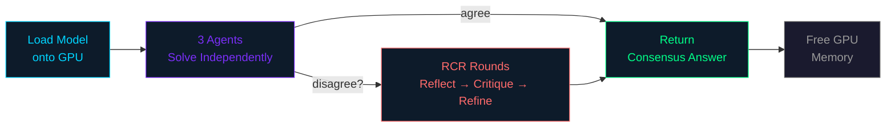

# Getting Started with DTE

This guide walks you through installing the DTE (Debate, Train, Evolve) framework,
running your first multi-agent debate, and understanding the core workflow.

## Table of Contents

- [System Requirements](#system-requirements)
- [Prerequisites](#prerequisites)
- [Installation](#installation)
- [Verify Installation](#verify-installation)
- [5-Minute Quickstart](#5-minute-quickstart)
- [Quick Start](#quick-start)
- [Your First Debate](#your-first-debate)
- [Understanding the Output](#understanding-the-output)
- [Next Steps](#next-steps)

---

## System Requirements

| Requirement | Minimum | Recommended |
|-------------|---------|-------------|
| **Python** | 3.9 | 3.10 or 3.11 |
| **OS** | Linux, macOS, Windows | Linux (Ubuntu 20.04+) |
| **RAM** | 16 GB | 32 GB |
| **Disk** | 10 GB free | 50 GB free (for models + caches) |
| **GPU** | CUDA-capable, 8 GB VRAM | NVIDIA A40/A100, 24+ GB VRAM |
| **CUDA** | 11.8 | 12.1+ |

**GPU requirements by model size:**

| Model | Debate (inference) | Training (LoRA) | Training (full) |
|-------|-------------------|-----------------|-----------------|
| 0.5B (Qwen2.5-0.5B) | ~2 GB VRAM | ~6 GB VRAM | ~8 GB VRAM |
| 1.5B (Qwen2.5-1.5B) | ~4 GB VRAM | ~10 GB VRAM | ~16 GB VRAM |
| 3B (Qwen2.5-3B) | ~8 GB VRAM | ~18 GB VRAM | ~32 GB VRAM |
| 7B (Qwen2.5-7B) | ~16 GB VRAM | ~24 GB VRAM | ~56 GB VRAM |
| 14B (Qwen2.5-14B) | ~32 GB VRAM | ~40 GB VRAM | ~112 GB VRAM |

CPU-only mode works for small models but is significantly slower.

---

## Prerequisites

- **Python**: 3.9 or newer (3.9, 3.10, 3.11 tested in CI)
- **Hardware**: A CUDA-capable GPU is strongly recommended for model inference
  and training. CPU-only mode works for small models but is much slower.
- **Disk space**: At least 10 GB free for model weights and caches.
- **RAM**: 16 GB minimum; 32 GB recommended when running 3-agent debates.

## Installation

### Option 1: pip install (from source, recommended)

```bash
git clone https://github.com/ctrl-gaurav/Debate-Train-Evolve.git
cd Debate-Train-Evolve
pip install -e .
```

### Option 2: From source with development extras

```bash
git clone https://github.com/ctrl-gaurav/Debate-Train-Evolve.git
cd Debate-Train-Evolve
pip install -e ".[dev]"
```

The `[dev]` extra installs testing and linting tools (`pytest`, `ruff`, `mypy`).

### Option 3: With GPU optimization extras

```bash
git clone https://github.com/ctrl-gaurav/Debate-Train-Evolve.git
cd Debate-Train-Evolve
pip install -e ".[gpu]"
```

### Optional extras

| Extra   | Command                        | What it adds                             |
|---------|--------------------------------|------------------------------------------|
| `dev`   | `pip install -e ".[dev]"`      | pytest, ruff, mypy                       |
| `wandb` | `pip install -e ".[wandb]"`    | Weights & Biases experiment tracking     |
| `gpu`   | `pip install -e ".[gpu]"`      | bitsandbytes (8-bit AdamW), flash-attn   |

### PyTorch installation (if not already installed)

If PyTorch is not already in your environment, install the correct version
for your CUDA version:

```bash
# CUDA 11.8
pip install torch --index-url https://download.pytorch.org/whl/cu118

# CUDA 12.1
pip install torch --index-url https://download.pytorch.org/whl/cu121

# CPU only (for testing without GPU)
pip install torch --index-url https://download.pytorch.org/whl/cpu
```

---

## Verify Installation

### Check the package version

```bash
python -c "import dte; print(dte.__version__)"
# Expected output: 0.1.0
```

### Check that ML dependencies are available

```python
python -c "
import dte
print(f'DTE version: {dte.__version__}')
print(f'ML imports available: {dte._FULL_IMPORTS_AVAILABLE}')

# Check GPU
import torch
print(f'PyTorch version: {torch.__version__}')
print(f'CUDA available: {torch.cuda.is_available()}')
if torch.cuda.is_available():
    print(f'GPU: {torch.cuda.get_device_name(0)}')
    print(f'VRAM: {torch.cuda.get_device_properties(0).total_memory / 1024**3:.1f} GB')
"
```

**Expected output** (GPU system):
```
DTE version: 0.1.0
ML imports available: True
PyTorch version: 2.x.x
CUDA available: True
GPU: NVIDIA A40
VRAM: 44.6 GB
```

### Run the test suite

```bash
# Run unit tests (no GPU required)
pytest -m "not gpu" -v --tb=short

# Run GPU integration tests (requires CUDA)
pytest -m gpu -v --tb=short
```

### Verify CLI works

```bash
python main.py info
```

---

## 5-Minute Quickstart

This is the absolute fastest path from installation to running a debate.
Copy and paste the entire block:

```python
import dte

# Run a 3-agent debate on a math problem
result = dte.debate(
    query="What is 15 * 24?",
    model="Qwen/Qwen2.5-0.5B-Instruct",   # smallest model (~1 GB)
    num_agents=3,
    max_rounds=3,
    task_type="math",
)

# Print the result
print(f"Answer:    {result.final_answer}")
print(f"Consensus: {result.consensus_reached}")
print(f"Rounds:    {result.total_rounds}")

# Expected output:
# Answer:    360
# Consensus: True
# Rounds:    1
```

That is it. The `dte.debate()` function handles model loading, agent creation,
the full debate loop, and GPU cleanup automatically.

### What just happened?



1. DTE loaded the Qwen2.5-0.5B-Instruct model onto your GPU
2. Three agents each independently solved "What is 15 * 24?"
3. If they disagreed, they entered RCR (Reflect-Critique-Refine) rounds
4. The final consensus answer was returned
5. GPU memory was freed automatically

### Try it from the command line

```bash
python main.py debate --query "What is 15 * 24?" --agents 3 --rounds 3
```

---

## Quick Start

The fastest way to use DTE is through the top-level convenience functions
exposed directly on the `dte` module.

### One-liner debate

```python
import dte

result = dte.debate(
    query="What is 15 * 24?",
    model="Qwen/Qwen2.5-0.5B-Instruct",
    num_agents=3,
    max_rounds=3,
    task_type="math",
)

print(result.final_answer)       # e.g. "360"
print(result.consensus_reached)  # True / False
```

### Load a full pipeline from a YAML config

```python
import dte

pipeline = dte.from_config("config.yaml")
results = pipeline.run_complete_pipeline()
```

### Train on previously generated debate data

```python
import dte

metrics = dte.train(
    data_path="debate_data.jsonl",
    model="Qwen/Qwen2.5-1.5B-Instruct",
    epochs=3,
)
print(metrics["epoch_losses"])
```

### Evaluate a model on benchmarks

```python
import dte

report = dte.evaluate(
    model="Qwen/Qwen2.5-1.5B-Instruct",
    datasets=["gsm8k"],
    max_samples=50,
)
print(f"Accuracy: {report['overall_metrics']['accuracy']:.2%}")
```

---

## Your First Debate

Below is a slightly more detailed example that gives you full control over the
debate configuration.

```python
from dte.core.config import ModelConfig, DebateConfig
from dte.debate.manager import DebateManager

# 1. Configure the model
model_config = ModelConfig(
    base_model_name="Qwen/Qwen2.5-0.5B-Instruct",
    device="auto",
    max_length=1024,
    temperature=0.7,
    top_p=0.9,
    top_k=50,
)

# 2. Configure the debate
debate_config = DebateConfig(
    num_agents=3,     # 3 agents debate each question
    max_rounds=3,     # up to 3 RCR rounds after initial responses
)

# 3. Create the manager and run
manager = DebateManager(debate_config, model_config)

result = manager.conduct_debate(
    query="A store sells apples at $3 each. If someone buys 5 apples "
          "and pays with a $20 bill, how much change do they get?",
    task_type="math",
)

# 4. Inspect the result
print(f"Final answer      : {result.final_answer}")
print(f"Consensus reached : {result.consensus_reached}")
print(f"Total rounds      : {result.total_rounds}")
print(f"Sycophancy rate   : {result.metrics['sycophancy_rate']:.2%}")

# 5. View the answer progression per round
for i, round_answers in enumerate(result.extracted_answers):
    print(f"Round {i}: {round_answers}")

# 6. Clean up GPU memory
manager.cleanup()
```

### What happens during the debate

```
    ┌──────────────────────────────────────────────────────────────┐
    │                    DEBATE FLOW                               │
    ├──────────────────────────────────────────────────────────────┤
    │                                                              │
    │  Round 0 (initial):                                          │
    │    Each agent independently solves the problem.              │
    │    Agent 1: $5   Agent 2: $5   Agent 3: $10                  │
    │                                                              │
    │  Round 1 (RCR):                                              │
    │    ┌─────────┐   ┌──────────┐   ┌─────────┐                 │
    │    │ REFLECT │──▶│ CRITIQUE │──▶│ REFINE  │                  │
    │    └─────────┘   └──────────┘   └─────────┘                  │
    │    Agent 1: $5   Agent 2: $5   Agent 3: $5  ◀── consensus!   │
    │                                                              │
    │  Debate ends. Final answer: $5                               │
    └──────────────────────────────────────────────────────────────┘
```

---

## Understanding the Output

The `DebateResult` object returned by `conduct_debate()` contains:

| Field                    | Type                        | Description                                       |
|--------------------------|-----------------------------|---------------------------------------------------|
| `final_answer`           | `str`                       | The majority-vote or consensus answer              |
| `consensus_reached`      | `bool`                      | Whether all agents agreed                          |
| `total_rounds`           | `int`                       | Number of debate rounds completed                  |
| `extracted_answers`      | `List[List[str]]`           | Answers per round per agent                        |
| `all_responses`          | `List[List[DebateResponse]]`| Full response objects per round per agent           |
| `agent_answer_history`   | `Dict[str, List[str]]`      | Per-agent answer trajectory                        |
| `sycophancy_history`     | `List[Dict[str, bool]]`     | Sycophancy flags per round                         |
| `consensus_progression`  | `List[bool]`                | Whether consensus existed at each round            |
| `confidence_progression` | `List[List[float]]`         | Confidence scores per round per agent              |
| `metrics`                | `Dict[str, Any]`            | Aggregate metrics (time, sycophancy rate, etc.)    |
| `consolidated_reasoning` | `str`                       | Best-of reasoning trace from debate                |
| `task_type`              | `str`                       | Task type used ("math", "arc", "general")          |

---

## Next Steps

| Goal                                  | Guide                                         |
|---------------------------------------|------------------------------------------------|
| Understand the framework architecture | [Architecture Guide](architecture.md)          |
| Explore every config option           | [Configuration Reference](configuration.md)    |
| Train a model with GRPO              | [Training Guide](training_guide.md)            |
| Evaluate on benchmarks                | [Evaluation Guide](evaluation.md)              |
| Browse full API docs                  | [API Reference](api_reference.md)              |
| Walk through example scripts          | [Examples](examples.md)                         |
| Debug common issues                   | [Troubleshooting](troubleshooting.md)          |
