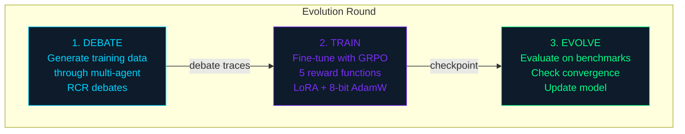
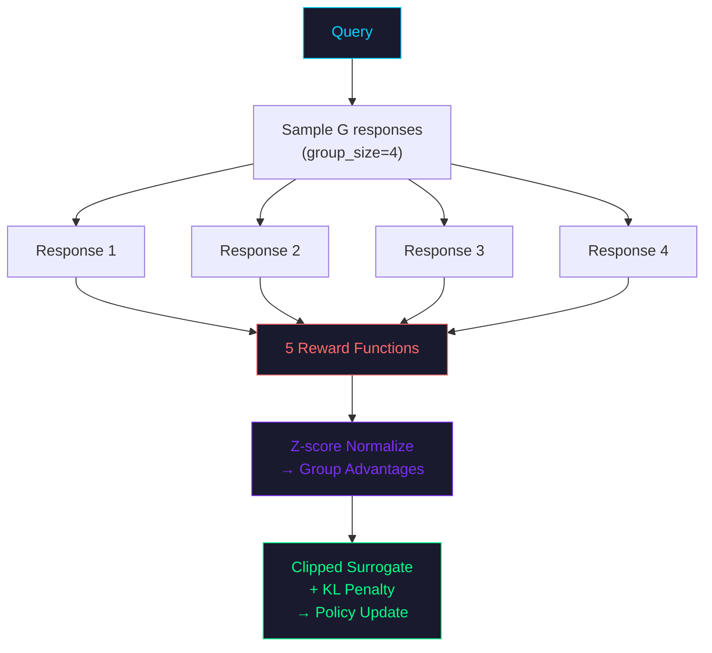
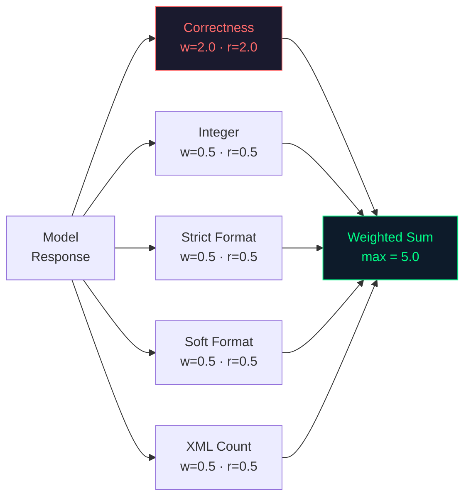

# Training Guide

Step-by-step guide to training models with the DTE framework using GRPO
(Group Relative Policy Optimization).

## Table of Contents

- [Overview](#overview)
- [Prerequisites](#prerequisites)
- [Step 1: Generate Debate Data](#step-1-generate-debate-data)
- [Step 2: Train with GRPO](#step-2-train-with-grpo)
- [Step 3: Evaluate the Trained Model](#step-3-evaluate-the-trained-model)
- [Step 4: Run Full Evolution Loop](#step-4-run-full-evolution-loop)
- [Understanding the Reward Functions](#understanding-the-reward-functions)
- [LoRA Configuration](#lora-configuration)
- [Multi-GPU Training](#multi-gpu-training)
- [Monitoring Training](#monitoring-training)
- [Common Training Recipes](#common-training-recipes)

---

## Overview

The DTE training loop follows three phases per evolution round:



GRPO is the training algorithm. Unlike standard RLHF which requires a
separate value function, GRPO estimates advantages by sampling multiple
responses per query and comparing their rewards within the group.



---

## Prerequisites

- A CUDA GPU (A40 or better recommended for 1.5B+ parameter models)
- The DTE framework installed: `pip install -e ".[gpu]"`
- For 8-bit AdamW: `pip install bitsandbytes`
- For LoRA: `pip install peft` (already in core dependencies)

Verify GPU availability:

```python
import torch
print(f"CUDA available: {torch.cuda.is_available()}")
print(f"GPU count: {torch.cuda.device_count()}")
```

---

## Step 1: Generate Debate Data

Before training, you need debate data. The framework generates this
automatically, but you can also do it manually:

```python
from dte.core.config import (
    DTEConfig, ModelConfig, DebateConfig, DatasetsConfig, DatasetInfo
)
from dte.data.generator import DebateDataGenerator
from dte.core.logger import DTELogger

# Configure
model_config = ModelConfig(
    base_model_name="Qwen/Qwen2.5-1.5B-Instruct",
    device="auto",
    max_length=2048,
    temperature=0.7,
)

debate_config = DebateConfig(
    num_agents=3,
    max_rounds=3,
)

datasets_config = DatasetsConfig(
    train_datasets=[
        DatasetInfo(name="gsm8k", path="openai/gsm8k",
                    split="train", max_samples=500),
    ]
)

# Generate data
generator = DebateDataGenerator(
    datasets_config, debate_config, model_config
)

examples = generator.generate_training_data(
    num_samples=200,
    evolution_round=0,
    save_path="./data/debate_training_data.jsonl",
)

print(f"Generated {len(examples)} training examples")
stats = generator.get_generation_statistics()
print(f"Consensus rate: {stats['consensus_rate']:.2%}")
print(f"Avg confidence: {stats['average_confidence']:.3f}")

generator.cleanup()
```

Each `TrainingExample` has:
- `query`: the original question
- `answer`: the consensus final answer
- `reasoning`: consolidated reasoning trace
- `confidence`: average agent confidence
- `source_dataset`: which benchmark it came from
- `debate_rounds`: how many rounds the debate took
- `consensus_reached`: whether agents agreed

---

## Step 2: Train with GRPO

### Quick training (one function call)

```python
import dte

metrics = dte.train(
    data_path="./data/debate_training_data.jsonl",
    model="Qwen/Qwen2.5-1.5B-Instruct",
    epochs=3,
    batch_size=4,
    learning_rate=2e-5,
    output_dir="./models",
    verbose=True,
)

print(f"Final epoch loss: {metrics['epoch_losses'][-1]:.4f}")
```

### Detailed training with full control

```python
from dte.core.config import (
    ModelConfig, TrainingConfig, PathsConfig, GRPOConfig, RewardsConfig, LoRAConfig
)
from dte.training.grpo_trainer import GRPOTrainer
from dte.data.generator import DebateDataGenerator

# Load previously generated data.
# Note: We use __new__ to skip the full __init__ (which requires a
# DebateManager with a loaded model).  load_generated_data() only
# needs self.logger, so this lightweight construction is safe.
generator = DebateDataGenerator.__new__(DebateDataGenerator)
generator.logger = None
examples = generator.load_generated_data("./data/debate_training_data.jsonl")

# Configure training
model_config = ModelConfig(
    base_model_name="Qwen/Qwen2.5-1.5B-Instruct",
    max_length=2048,
)

training_config = TrainingConfig(
    learning_rate=2e-5,
    weight_decay=0.01,
    warmup_steps=50,
    max_epochs=3,
    batch_size=4,
    gradient_accumulation_steps=4,   # effective batch = 16
    grpo=GRPOConfig(
        group_size=4,        # 4 responses sampled per query
        clip_ratio=0.2,      # PPO clip epsilon
        kl_penalty=0.02,     # KL divergence penalty
    ),
    rewards=RewardsConfig(
        correctness_weight=2.0,
        int_weight=0.5,
        strict_format_weight=0.5,
        soft_format_weight=0.5,
        xmlcount_weight=0.5,
    ),
    lora=LoRAConfig(
        enabled=True,
        rank=128,
        alpha=256,
        dropout=0.05,
    ),
)

paths_config = PathsConfig(models_dir="./models/grpo_run1")

# Train
trainer = GRPOTrainer(training_config, model_config, paths_config)
metrics = trainer.train(examples)

# Inspect results
for epoch, loss in enumerate(metrics["epoch_losses"]):
    print(f"Epoch {epoch + 1}: loss={loss:.4f}")

if "reward_stats" in metrics and metrics["reward_stats"]:
    final_rewards = metrics["reward_stats"][-1]
    print(f"Final mean reward: {final_rewards['mean_reward']:.3f}")

trainer.cleanup()
```

---

## Step 3: Evaluate the Trained Model

After training, evaluate on benchmarks:

```python
import dte

report = dte.evaluate(
    model="./models/grpo_run1/checkpoint_epoch_2",  # or HF model name
    datasets=["gsm8k", "arc_challenge"],
    num_agents=3,
    max_rounds=3,
    max_samples=100,
    verbose=True,
)

print(f"Overall accuracy: {report['overall_metrics']['accuracy']:.2%}")
print(f"Consensus rate:   {report['overall_metrics']['consensus_rate']:.2%}")
print(f"Debate helped:    {report['overall_metrics']['debate_helped_rate']:.2%}")
```

---

## Step 4: Run Full Evolution Loop

The full pipeline automates everything:

```python
import dte

pipeline = dte.from_config("config.yaml")
results = pipeline.run_complete_pipeline()

print(f"Total time:   {results['total_time_hours']:.2f} hours")
print(f"Best perf:    {results['best_performance']:.4f}")
print(f"Improvement:  {results['total_improvement']:.4f}")
print(f"Converged:    {results['convergence_achieved']}")
```

The pipeline automatically:
1. Generates debate data (Phase 1)
2. Trains with GRPO (Phase 2)
3. Evaluates on benchmarks (Phase 3)
4. Checks convergence and repeats

---

## Understanding the Reward Functions

DTE uses 5 complementary reward functions to train the model:



### 1. Correctness Reward (`correctness_reward_func`)

- **Score**: +2.0 for correct answer, 0.0 for incorrect
- **Weight**: 2.0 (most important signal)
- Compares extracted answer against ground truth

### 2. Integer Reward (`int_reward_func`)

- **Score**: +0.5 if the extracted answer is numeric
- **Weight**: 0.5
- Encourages models to produce concrete numerical answers

### 3. Strict Format Reward (`strict_format_reward_func`)

- **Score**: +0.5 for exact XML format:
  ```
  <reasoning>\n...\n</reasoning>\n<answer>\n...\n</answer>\n
  ```
- **Weight**: 0.5
- Rewards perfect adherence to the expected output structure

### 4. Soft Format Reward (`soft_format_reward_func`)

- **Score**: +0.5 for flexible XML format:
  ```
  <reasoning>...</reasoning>...<answer>...</answer>
  ```
- **Weight**: 0.5
- More lenient than strict format; rewards basic XML structure

### 5. XML Count Reward (`xmlcount_reward_func`)

- **Score**: Up to +0.5 based on granular tag counting:
  - +0.125 for exactly one `<reasoning>` tag
  - +0.125 for exactly one `</reasoning>` tag
  - +0.125 for exactly one `<answer>` tag
  - +0.125 for exactly one `</answer>` tag
  - -0.001 per character after `</answer>` (penalizes trailing content)
- **Weight**: 0.5

### Reward Combination

Rewards are combined as a **weighted sum** (not weighted average):

```
combined = sum(reward_i * weight_i for each function)
```

With default weights and a perfect response:
```
2.0 * 2.0 + 0.5 * 0.5 + 0.5 * 0.5 + 0.5 * 0.5 + 0.5 * 0.5 = 5.0
```

### Inspecting Rewards

```python
from dte.training.reward_model import DTERewardModel

model = DTERewardModel()

response = "<reasoning>\n6 * 7 = 42\n</reasoning>\n<answer>\n42\n</answer>\n"

rewards = model.calculate_all_rewards(
    query="What is 6 * 7?",
    responses=[response],
    ground_truth="42",
)

for name, values in rewards.items():
    print(f"  {name}: {values[0]:.3f}")

# Combine with DTE weights
combined = model.combine_rewards(rewards, {
    "correctness": 2.0, "int": 0.5,
    "strict_format": 0.5, "soft_format": 0.5, "xmlcount": 0.5,
})
print(f"  COMBINED: {combined[0]:.3f}")
```

---

## LoRA Configuration

DTE uses LoRA (Low-Rank Adaptation) for parameter-efficient fine-tuning.
The default configuration targets all linear layers in the model:

```yaml
lora:
  enabled: true
  rank: 128        # LoRA rank (paper default)
  alpha: 256       # Scaling factor (typically 2 * rank)
  dropout: 0.05    # Regularization
  target_modules:  # All linear layers for Qwen-style architectures
    - "q_proj"
    - "k_proj"
    - "v_proj"
    - "o_proj"
    - "gate_proj"
    - "up_proj"
    - "down_proj"
```

**Memory savings**: With LoRA rank 128, only about 2-5% of the model's
parameters are trainable, dramatically reducing GPU memory requirements.

**Disabling LoRA**: Set `lora.enabled: false` to do full fine-tuning.
This requires significantly more GPU memory.

---

## Multi-GPU Training

DTE supports multi-GPU training through HuggingFace's `device_map="auto"`:

```bash
# Use GPUs 0, 1, 3, 4
CUDA_VISIBLE_DEVICES=0,1,3,4 python your_training_script.py
```

The model is automatically sharded across available GPUs. During debate,
the shared model registry ensures only one copy is loaded across all agents.

For very large models (7B+), you may want to adjust:

```yaml
hardware:
  device: "auto"
  mixed_precision: true
  max_memory_per_gpu: "40GB"
  gradient_checkpointing: true
```

---

## Monitoring Training

### Console output

Set `verbose=True` or configure logging level to `"INFO"`:

```python
metrics = dte.train(data_path="data.jsonl", verbose=True)
```

### Training metrics

The returned metrics dictionary contains:

| Key                  | Type           | Description |
|----------------------|----------------|-------------|
| `epoch_losses`       | `List[float]`  | Average loss per epoch |
| `step_losses`        | `List[float]`  | Loss per training step |
| `learning_rates`     | `List[float]`  | LR at each step |
| `kl_divergences`     | `List[float]`  | KL divergence per step |
| `advantages_stats`   | `List[dict]`   | Mean/std/min/max of advantages |
| `reward_stats`       | `List[dict]`   | Mean/std/min/max of rewards |

### Weights & Biases integration

Enable W&B in the experiment config:

```yaml
experiment:
  wandb:
    enabled: true
    project: "dte-training"
    entity: "your-team"
```

---

## Common Training Recipes

### Quick test run

```python
import dte
metrics = dte.train("data.jsonl", epochs=1, batch_size=2, verbose=True)
```

### Standard 1.5B training (paper settings)

```yaml
model:
  base_model_name: "Qwen/Qwen2.5-1.5B-Instruct"
  max_length: 2048

training:
  learning_rate: 2e-5
  max_epochs: 3
  batch_size: 4
  gradient_accumulation_steps: 4
  grpo:
    group_size: 4
    clip_ratio: 0.2
    kl_penalty: 0.02
  lora:
    enabled: true
    rank: 128
    alpha: 256
```

### Aggressive training (higher LR, more epochs)

```yaml
training:
  learning_rate: 5e-5
  max_epochs: 5
  warmup_steps: 100
  grpo:
    group_size: 8
    kl_penalty: 0.01   # less conservative
```

### Conservative training (lower LR, stronger regularization)

```yaml
training:
  learning_rate: 1e-5
  max_epochs: 2
  weight_decay: 0.05
  grpo:
    group_size: 4
    kl_penalty: 0.05   # stronger KL penalty
```
